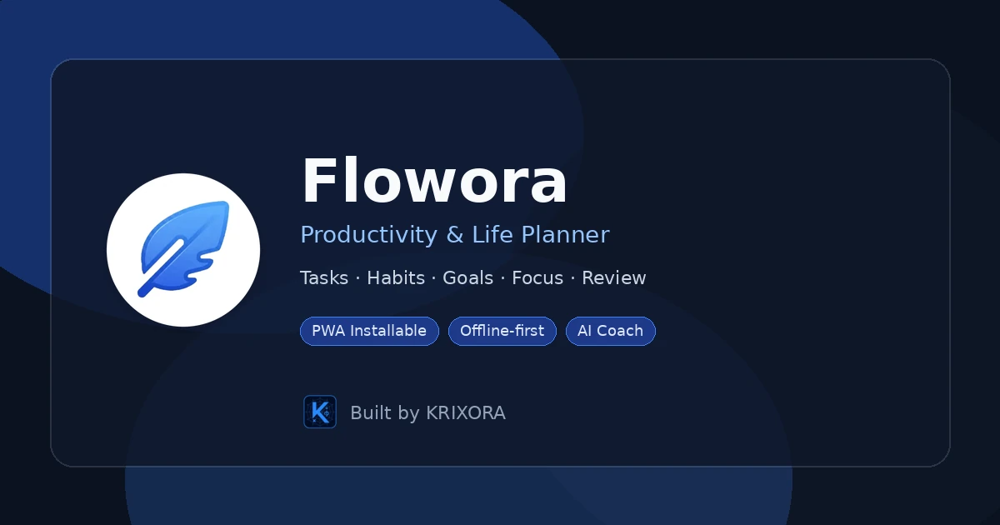
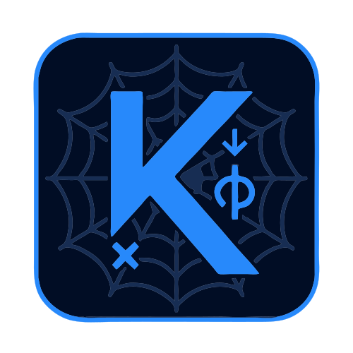

<div align="center">

# Flowora

### Productivity & Life Planner (Installable PWA)

Tasks · Habits · Goals · Focus Timer · Review · Templates · Offline-first

<p align="center">
  <a href="https://flowora-ai.vercel.app">
    
  </a>
  <a href="https://github.com/KRIXORA/Flowora">
    
  </a>
  
</p>

<p align="center">
  
  
  
  
  
</p>

</div>

---

## Live demo

**https://flowora-ai.vercel.app**

---

## About

**Flowora** is an offline-first productivity app: plan tasks, build habits, track goals, run focus sessions, and review your day. It installs as a **PWA**, works without an account, and stays usable on phone and desktop.

Built by **[KRIXORA](https://krixora-portfolio.vercel.app/)**.

---

## Features

| Area | What you get |
|------|----------------|
| **Home** | Focus score, today’s tasks, habit streaks, focus time |
| **Planner** | Morning / Afternoon / Evening task blocks |
| **Calendar** | Day events |
| **Focus Timer** | Pomodoro sessions + browser notification on end |
| **Goals & Habits** | Progress, streaks, undo on delete |
| **Review** | Daily snapshot: done / open / habits left / insight |
| **Templates** | Morning, Work deep-work, Student day (one tap) |
| **AI Coach** | Local assistant (optional API key / proxy) |
| **Progress** | Simple analytics |
| **Settings** | Profile, reminders, backup export/import, theme |

### Quality of life

- First-run **onboarding** guide  
- **Tags** + **recurring** tasks (daily / weekdays / weekly)  
- **Undo** toast (tasks, habits, goals, planner)  
- **Keyboard shortcuts** — press `?` or header keyboard icon  
- **Reminders** — evening habits + optional midday tasks  
- **Installable** PWA (manifest + service worker)  
- **WebP** icons + OG image; `robots.txt` + `sitemap.xml`  
- Responsive layout (phone → desktop)

---

## Preview



OG / social image: `assets/images/preview.webp` (**1200×630**).

---

## Quick start (no npm)

1. Unzip the project  
2. Open folder in VS Code → **Live Server** on `index.html`  

Or:

```bash
cd Flowora-main
python3 -m http.server 8080
```

Open **http://localhost:8080**

> Do **not** open via `file://` double-click. Use a local server.

### Local dev with live-reload (optional)

```bash
npm install
npm run dev
```

This just runs Vite as a local static dev server for `index.html` +
`assets/js/` — it doesn't build or bundle anything.

---

## Keyboard shortcuts

| Keys | Action |
|------|--------|
| `Ctrl/⌘ + K` | Command palette / search |
| `?` | Shortcuts help |
| `Esc` | Close modals / menu |
| `G` then `H/P/F/C/O/B/R/A/I/S` | Jump to Home, Planner, Focus, Calendar, Goals, Habits, Review, Progress, AI, Settings |
| `N` | Focus quick-add (Home) |
| `T` | Day templates |

---

## SEO & Search Console

After deploy:

1. [Google Search Console](https://search.google.com/search-console) → add property  
2. Sitemap: `https://flowora-ai.vercel.app/sitemap.xml`  
3. Robots: `https://flowora-ai.vercel.app/robots.txt`

---

## Cloud sync

The app works fully offline and doesn't need an account. There's no
cloud sync or login built in currently.

---

## Tech stack

| Tech | Role |
|------|------|
| HTML5 / CSS3 / Vanilla JS | UI & logic |
| localStorage | Persistence |
| Service Worker + Manifest | PWA / offline |

---

## Project structure (classic path)

```text
Flowora-main/
├── index.html
├── manifest.json
├── sw.js
├── robots.txt
├── sitemap.xml
├── vercel.json         # forces static deploy (no build step)
├── assets/
│   ├── brand/          # KRIXORA mark
│   ├── css/
│   ├── js/             # App modules (use this path)
│   ├── icons/          # WebP + apple-touch PNG
│   └── images/         # preview.webp
```

---

## Built by

[](https://krixora-portfolio.vercel.app/)

**[KRIXORA](https://krixora-portfolio.vercel.app/)** — portfolio & more projects.

---

## License

See [LICENSE](LICENSE).
